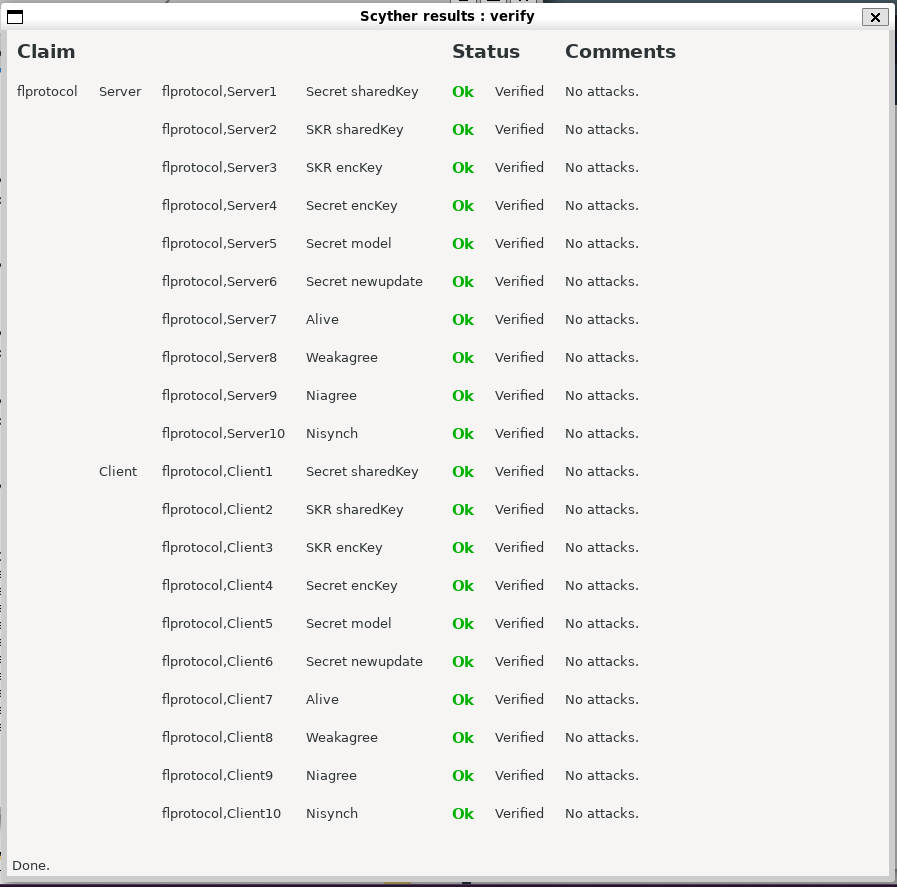

The protocol defines a message exchange to establish  shared secrets:
1.  A **`sharedKey`** (likely for a Key Exchange Mechanism - KEM).

Using these keys, the protocol securely exchanges a machine learning `model` from the server to the client and receives a `newupdate` from the client.

The protocol was formally specified and analyzed using the **Scyther** verification tool.

## Security Claims

The protocol was tested against the following security properties for both the `Server` and `Client` roles:

**Secrecy:**
* `claim(Secret, sharedKey)`: The established shared key remains secret.
* `claim(Secret, encKey)`: The derived encryption key remains secret.
* `claim(Secret, model)`: The ML model remains secret during transit.
* `claim(Secret, newupdate)`: The client's update remains secret during transit.

**Session Key Reveal (SKR):**
* `claim(SKR, sharedKey)`: The shared key is not compromised.
* `claim(SKR, encKey)`: The encryption key is not compromised.

**Authentication & Agreement:**
* `claim(Alive)`: Roles are assured of each other's liveness.
* `claim(Weakagree)`: Roles agree on the participants.
* `claim(Niagree)`: Roles agree on the data and nonces (Non-injective agreement).
* `claim(Nisynch)`: Roles agree on the data and nonces and the protocol flow (Non-injective synchronisation).

---

## Verification Results

**All security claims passed successfully.**

The Scyther tool analyzed the protocol for an unbounded number of sessions against a Dolev-Yao attacker and found no vulnerabilities corresponding to the specified claims.

The Scyther tool analyzed the protocol for an unbounded number of sessions against a Dolev-Yao attacker and found no vulnerabilities corresponding to the specified claims.

